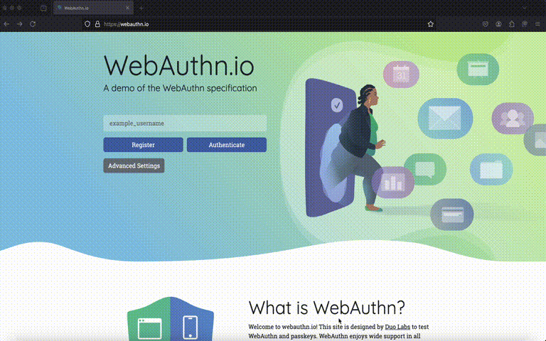

# BrainChain: A brainwallet for WebAuthN/Passkeys

# What is this?

A (very incomplete but functional) stateless [WebAuthN](https://www.w3.org/TR/webauthn-3/) implementation in a Firefox extension. Think [deterministic password manager](https://crypto.stackexchange.com/questions/11464/what-are-the-pros-and-cons-of-deterministic-site-specific-password-generation-fr), but for passkeys!

"Login" with your passphrase, and you can create non-discoverable WebAuthN credentials (don't call them passkeys, but definitely be reminded of them) at ~all~ some websites supporting them, such as https://webauthn.io, and later authenticate to these same sites *on any device* on which you have the extension installed – as long as they support "non-discoverable credentials" and don't use any fancy options that I haven't implemented yet.

# Building

No need: I don't have any experience with fancy browser/web development build pipelines, and I don't even know what a bundler is, so this is all pure JavaScript.

# Installation

Please don't (see below for details), but if you must: Open `about:debugging` in Firefox, click "Load Temporary Add-On" on the "This Firefox" tab, and open the `manifest.json` file of this repository in it.

# How does it work?

WebAuthN supports two basic implementation models:

- Discoverable credentials, which are by definition always stateful, and can be enumerated by the website (or "relying party", in WebAuthN parlance) at the time you're trying to log in. Among other things, this allows "usernameless" login flows.
- Non-discoverable credentials, which an implementation only has to recognize after being presented with the corresponding "credential ID".

Usually, the former is used by password managers such as Bitwarden, 1Password, or iCloud Keychain. Since these password managers have to store an unlimited number of accounts and credentials anyway (usually in encrypted form on the hard disk, with a root secret protecting that file), storing yet a few more bytes for a representation of credential metadata is usually not a big deal. (As a side note, discoverable credentials that are synchronized to the cloud are called "passkeys.")

The latter is very useful for implementing authenticators in embedded hardware, such as a hardware security key (e.g. a Yubikey, a [homebrew JavaCard implementation](https://github.com/BryanJacobs/FIDO2Applet) etc). Such devices often have a very limited amount of storage available to them, and rather than limiting the number of credentials that users can store on them, they use a pretty neat trick:

Since the credential ID can be an arbitrary byte string, which has to be provided to the authenticator implementation every time a relying party wants to perform user authentication, authenticators can *dynamically re-derive the private key* associated with a WebAuthN credential just in time for the signature operation – which means that a single security key can "store" an unlimited number of credentials on it.

But nothing in the specification says that non-discoverable credentials have to be backed by secure hardware! So why not make use of one of the most unreliable storage media/randomness generators known to science: The human brain.

# Oh no...

Oh yes. If this reminds you of cryptocurrency "[brain wallets](https://en.bitcoin.it/wiki/Brainwallet)", you can probably see where the inspiration for the project name came from.

Just like you should never entrust your precious memecoins to a brainwallet, **please don't actually use this project either to authenticate to real websites!** This software comes with no warranty, and this is not just a standard boilerplate disclaimer:

If you use this in production, there's a very high chance that your accounts or even your passphrase will be compromised (the server side can brute force it due to the construction!), since both the cryptographic construction and the WebAuthN implementation have been written by somebody that has approximately no idea what they are doing. Don't roll your own crypto, they say, and I very much did here.

# Cryptographic implementation

Now with that out of the way, here's how it works under the hood:

The basic idea is that we can
- Derive a `rootSecret` from a passphrase using key hardening (currently PBKDF2 with 10,000 rounds)
- Whenever a website `rpId` requests creation of a credential, generate a credential ID of `credentialID = random || SHA-256(rootSecret || rpId || random)` (essentially an HMAC authentication tag) and return it to the website, *which stores it for us*. We also derive private ECDSA key as `privK = SHA-256(rootSecret || credentialId)` and return the corresponding P-256 public key `pubK = derivePublicFromPrivate(privK)` as well.
- At authentication/login time, the website provides us with `rpId` and `credentialId` – everything we need to re-derive *the same private key*!

## Why an authentication tag?

The authentication tag is not really required for security under the WebAuthN model: The key insight here is that signatures are always scoped to an rpId by implementations, so even if an evil relying party were to manage to to intercept and replay a credentialId belonging to another rpId, any such signatures should be rejected by compliant relying parties.

It's also not required for privacy: We could use the (origin-verified) rpId as an input into key generation, so website A couldn't collude with websites B, C etc. and share a `credentialId` in order to see if our client returns the same publicKey (it's explicitly part of all WebAuthN authentication operation responses, but even if it weren't, ECDSA allows recovering the public key from the signature).

Still, by enforcing this "domain binding" on our side we can avoid that server-side implementation pitfall, and on top of that, this lets us identify whether a given `credentialId` "is ours": Users can use multiple credentials on the same account, and it would be awkward to derive a non-existing key and create a (to the relying party) meaningless signature over it, which the relying party could then only reject in confusion. If we are able to tell "our" from others' credentials, we can provide a much better user experience and fall back to a different authenticator implementation within the same browser.

# Why did you do this?

In the words of a great scientist: We do what we must becase we can. I wanted to see if it's possible!

Other than that, I was curious to see how complicated/fun it would be to write a browser extension as somebody that has no experience in web development or JavaScript at all, and how much help a modern LLM would be.

Finally, I wanted to demonstrate that you can totally implement WebAuthN in a way that real-world websites support without being Apple or Google or synchronizing your passkeys to the cloud (or in fact even store them anywhere!), two common criticisms of a largely very thoughtfully designed and useful technology. (That said, I do hope that non-discoverable credentials will stick around (life is [currently hard](https://github.com/w3c/webauthn/issues/1822) for limited-storage authenticators, for no good reason!) and that attestation will remain optional.)

# TO DO

I don't have any plans to make this an actual product at this point. Still, here's a very incomplete list of what would probably have to be done before this could ever be one (and as mentioned above, it probably never should):

- [ ] User presence detection (Without this, any random website can *use this extension to fingerprint you* and even start running brute-force attacks on your passphrase! Did I mention that you shouldn't ever install this in your production browser?)
- [x] Validate whether a given origin is consistent with its purported `rpId`. (Right now, we essentially trust the website that it wouldn't lie to us about who it is. This means that websites can most likely "steal" your passkeys for *other* websites and is a big privacy problem.)
- [ ] Vet my extremely ad hoc cryptographic construction in `background/webauthn.js`. (For all I know, I'm actually creating the same keys for all websites.)
- [ ] Implement "authenticator chaining".
    - [ ] For registration, we could provide a button to use any other implementation, e.g. that provided by the OS, browser, or another extension. 
    - [x] For authentication, we can silently fall through to the native implementation for unrecognized credential IDs.
- [ ] Actual tests

# Thanks

Shoutouts to

- Bitwarden, for developing an open-source browser-based (and iOS, and supposedly soon macOS) WebAuthN implementation that you should actually use. You can even self-host it with the excellent [Vaultwarden](https://github.com/dani-garcia/vaultwarden).
- Adam Langley, for writing a literal [book](https://www.imperialviolet.org/tourofwebauthn/tourofwebauthn.html) on passkeys, the [HN discussion of which](https://news.ycombinator.com/item?id=42516800) has motivated me to actually do this.
- Mozilla/Firefox, for providing a surprisingly great Web Extension debugging environment and lots of helpful documentation.